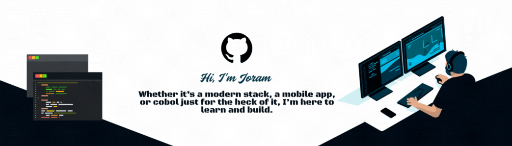
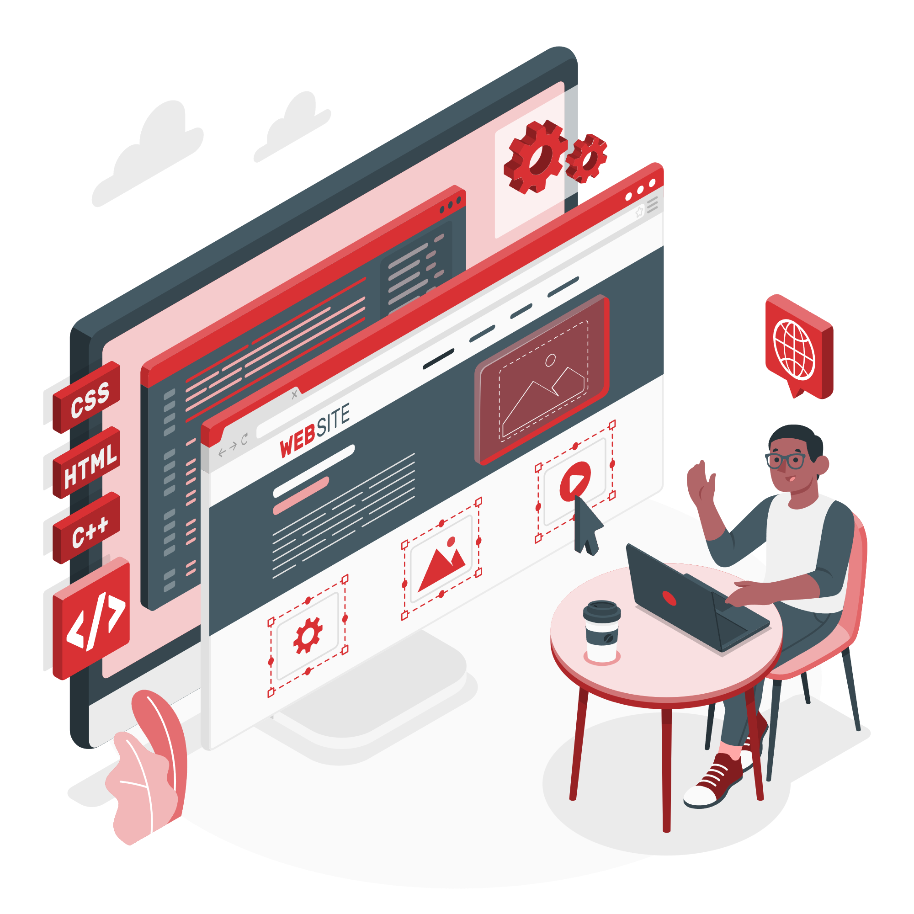
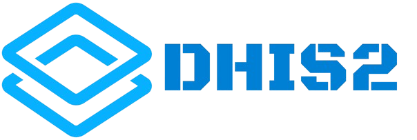

 
<b> Full-Stack Developer</b> 

  

Results-driven dev, 3+ years building scalable web apps with React, Next.js, Go, and PostgreSQL.

- Code optimizer & workflow automator
- Currently: Advanced Go & cloud
- Mentor, team player
- NEEMA | SaaS, dashboards
- Salesforce, React, TypeScript, Go, PostgreSQL, Lynx js

  

---

 
 
 

<h2 align="center">Achievements</h2> 
<picture>
  <source media="(prefers-color-scheme: dark)" srcset="./assets/Skills_Animation_Dark.gif">
  <source media="(prefers-color-scheme: light)" srcset="./assets/Skills_Animation_White.gif">
  
</picture>
 

<h3 align="left">Skills</h3>
<ul>
  <li><b>Programming Languages:</b> JavaScript (ES6+), TypeScript, Go, Python, PHP, Apex, C++</li>
  <li><b>Frontend:</b> React.js, Next.js, Angular, Vue.js,Jest, Lightning Web Components (LWC), Tailwind CSS, Material UI</li>
  <li><b>Backend:</b> Go, Strapi, Node.js, Apex, Python, Directus</li>
  <li><b>Databases:</b> PostgreSQL, MongoDB, SQL, SOQL</li>
  <li><b>Tools & Platforms:</b> Git, Docker, Salesforce, Directus, WordPress, AWS, Bun</li>
  <li><b>Soft Skills:</b> Effective Communication, Team Collaboration, Mentorship, Time Management, Problem Solving, Code Reviews</li>
</ul>

 

---

<h2 align="center">Published NPM Packages</h2>

| Package                                                                | Description                                   | Tech                |
| ---------------------------------------------------------------------- | --------------------------------------------- | ------------------- |
| [next-navlink](https://www.npmjs.com/package/next-navlink)             | Enhanced navigation for Next.js apps          | TypeScript, Next.js |
| [react-navplus](https://www.npmjs.com/package/react-navplus)           | Advanced navigation for React                 | TypeScript, React   |
| [react-cmp-selector](https://www.npmjs.com/package/react-cmp-selector) | Reusable UI component selector for React apps | TypeScript, React   |

---

<h3>Work Experience</h3>
<ul>
  <li><b>Full-Stack Developer</b>, NEEMA – Scalable web apps with React, Next.js, Go, PostgreSQL</li>
  <li><b>Content Moderator</b>, Telegram – Ensured quality & compliance for online communities</li>
  <li><b>Frontend Developer</b>, WiiQare – Built admin dashboards with Next.js, Material UI</li>
  <li><b>WordPress Developer</b>, CAON FED – Custom WordPress document systems</li>
  <li><b>Offshore Salesforce Developer</b>, TotalEnergies – Improved UI with LWC and Apex</li>
  <li><b>Salesforce Offshore Developer</b>, Oeneo – Salesforce maintenance & Apex dev</li>
</ul>
 

---

<h2 align="center">Certifications</h2>

<table width="100%">
  <tr>
    <td width="50%" align="center">
      
      <h4>Salesforce Certified Platform Developer I</h4>
      
<em>Advanced Apex development and platform expertise</em>

    </td>
    <td width="50%" align="center">
      
      <h4>Salesforce Certified JavaScript Developer I</h4>
      
<em>Lightning Web Components and JavaScript mastery</em>

    </td>
  </tr>
  <tr>
    <td width="50%" align="center">
      
      <h4>Aggregate Data Analysis Fundamentals</h4>
      
<em>Healthcare data management and analysis</em>

    </td>
    <td width="50%" align="center">
      
      <h4>Aggregate Data Capture & Validation</h4>
      
<em>Data quality assurance and validation techniques</em>

    </td>
  </tr>
  <tr>
    <td colspan="2" align="center">
      
      <h4>Introduction to DHIS2</h4>
      
<em>Health information system fundamentals</em>

    </td>
  </tr>
</table>

---

<!--Trophies Section-->
<h2 align="center"> Gɪᴛʜᴜʙ Tʀᴏᴘʜɪᴇs & Aᴄʜɪᴇᴠᴇᴍᴇɴᴛs</h2>

  <a href="https://github.com/Walter0b">
    <picture>
      <source media="(prefers-color-scheme: dark)" srcset="https://github-profile-trophy.vercel.app/?username=Walter0b&no-bg=true&row=2&column=6&margin-w=20&margin-h=20&theme=monokai">
      <source media="(prefers-color-scheme: light)" srcset="https://github-profile-trophy.vercel.app/?username=Walter0b&no-bg=true&row=2&column=6&margin-w=20&margin-h=20">
      
    </picture>
  </a>

 

<!--Github stats Table-->
<h2 align="center"> Gɪᴛʜᴜʙ Sᴛᴀᴛɪsᴛɪᴄs & Pᴇʀғᴏʀᴍᴀɴᴄᴇ </h2>

<table width="100%">
  <tr>
    <td width="50%" valign="top">
      <h3 align="center"><strong>GitHub Stats</strong></h3>
      

        
      

    </td>
    <td width="50%" valign="top">
      <h3 align="center"><strong>Streak Stats</strong></h3>
      

        
      

    </td>
  </tr>
</table>

---
<!-- Performance Metrics -->
<h2 align="center">Performance Metrics</h2>

  <table>
    <tr>
      <td align="center"></td>
      <td align="center"></td>
      <td align="center"></td>
    </tr>
    <tr>
      <td align="center"></td>
      <td align="center"></td>
      <td align="center"></td>
    </tr>
  </table>

